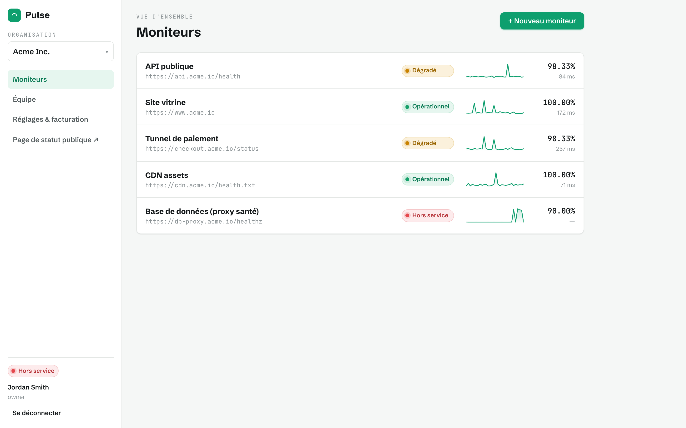
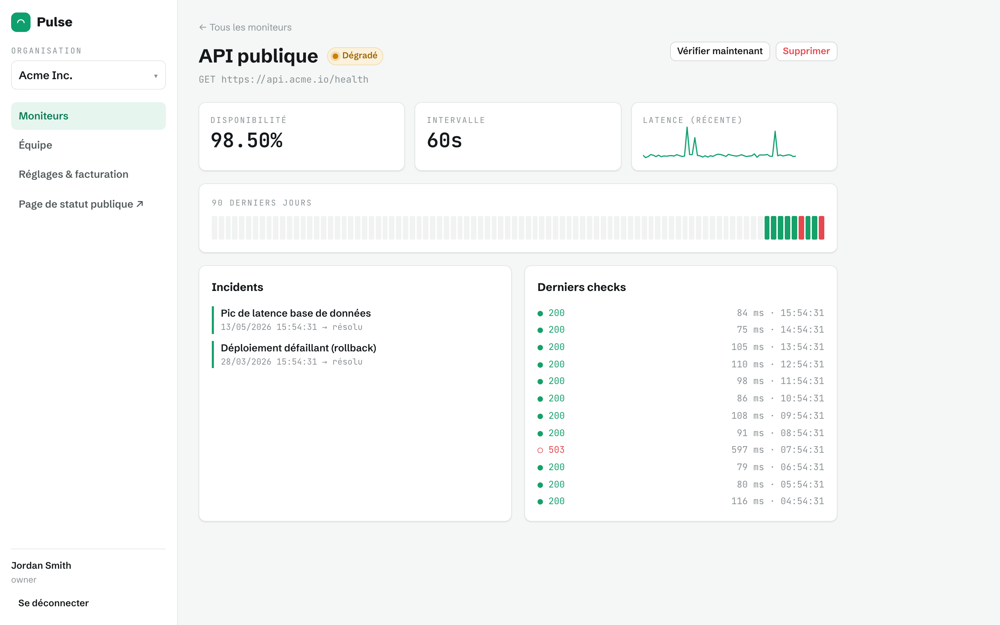
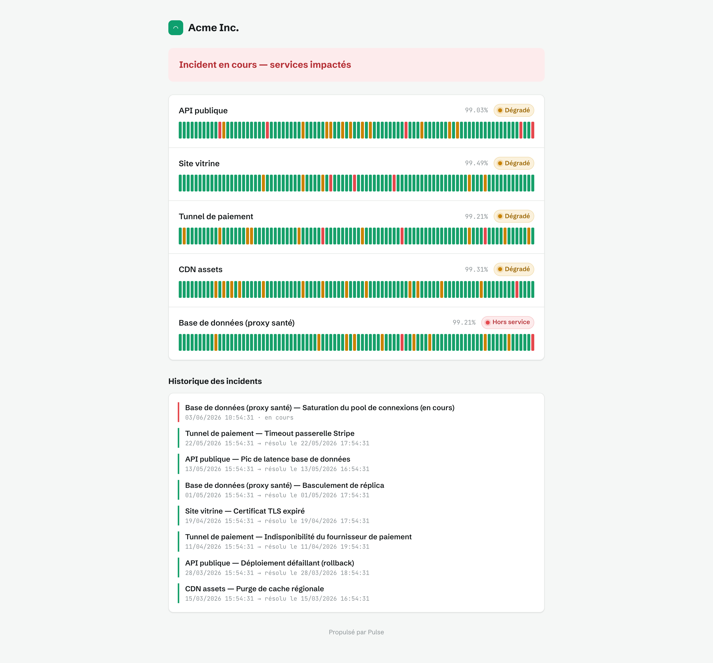
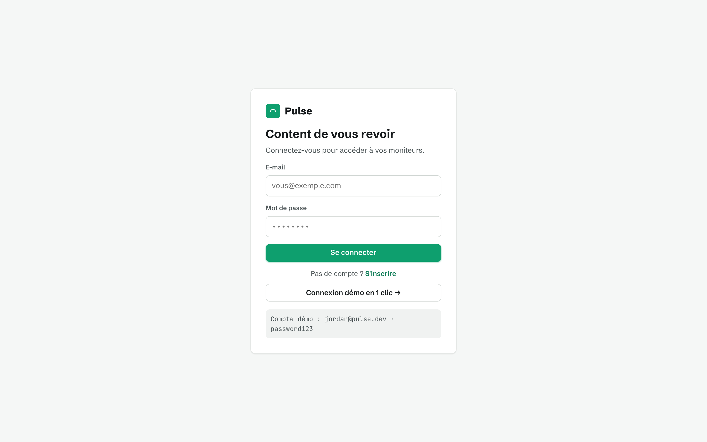
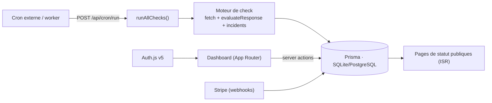

# Pulse · monitoring d'uptime & pages de statut

> _SaaS **multi-tenant** de surveillance : checks planifiés, incidents & alertes, et **pages de statut publiques** élégantes. Next.js full-stack, prêt pour la production._


Pulse surveille des endpoints HTTP, calcule leur disponibilité et leur latence, ouvre automatiquement des **incidents** en cas de panne, et publie une **page de statut publique** par organisation. C'est un vrai SaaS : **organisations, équipes, RBAC, abonnements Stripe**.

> ⚠️ Ce n'est **pas** une vitrine de design : l'accent est mis sur le back-end (BDD, auth, jobs, facturation, tests). L'UI reste néanmoins soignée — registre « console d'exploitation ».

## 🖼️ Aperçu

| Dashboard | Détail d'un moniteur |
|---|---|
|  |  |

| Page de statut publique (ISR) | Connexion — démo en 1 clic |
|---|---|
|  |  |

## 📋 Sommaire

- [Fonctionnalités](#-fonctionnalités)
- [Architecture](#-architecture)
- [Modèle de données](#-modèle-de-données)
- [Stack technique](#-stack-technique)
- [Démarrage rapide](#-démarrage-rapide)
- [Checks : worker & cron](#-checks--worker--cron)
- [Facturation (Stripe, optionnelle)](#-facturation-stripe-optionnelle)
- [Tests](#-tests)
- [Déploiement](#-déploiement)
- [Ce que ce projet démontre](#-ce-que-ce-projet-démontre)
- [Licence](#-licence)

## ✨ Fonctionnalités

- **Multi-tenant** : organisations, membres, **RBAC** (`owner` / `admin` / `member`) appliqué côté serveur.
- **Authentification** Auth.js v5 (credentials, mots de passe hashés bcrypt, sessions JWT).
- **Moniteurs** HTTP : intervalle, statut attendu, timeout ; **disponibilité, latence** (sparklines), historique.
- **Incidents** ouverts/résolus automatiquement selon les checks ; **alertes** (webhook/console ; e-mail/Slack documentés).
- **Pages de statut publiques** par organisation, rendues en **ISR** (rapides, mises en cache).
- **Abonnements Stripe** (plans free/pro) avec limites par plan — optionnel (mode démo sans clés).

## 🏗️ Architecture



- **Server Components + Server Actions** : pas d'API REST à maintenir côté UI ; les mutations passent par des actions typées avec contrôle RBAC.
- **Logique métier pure & testée** (`src/lib/domain/`) : évaluation des réponses, calcul d'uptime, transitions d'incident, RBAC, limites de plan — découplée de Prisma/Next.
- **ISR** pour les pages publiques : régénérées toutes les 60 s, servies depuis le cache.

## 🗄️ Modèle de données

`User` ──< `Membership` >── `Organization` ──< `Monitor` ──< `Check`
                                                  └──< `Incident`

Le `Membership` porte le **rôle** (multi-tenant + RBAC). Chaque `Monitor` accumule des `Check` (résultats horodatés) et des `Incident`.

## 🧱 Stack technique

| Couche | Technologies |
|--------|--------------|
| Framework | Next.js 14 (App Router), React 18, TypeScript |
| Données | Prisma 5 · SQLite (dev) / PostgreSQL (prod) |
| Auth | Auth.js v5 (Credentials, JWT) · bcrypt |
| Validation | Zod |
| Facturation | Stripe (abonnements + webhooks) — optionnel |
| Tests | Vitest (logique métier) |
| Outillage | Docker, GitHub Actions |

## 🚀 Démarrage rapide

```bash
cp .env.example .env        # SQLite par défaut : aucune config requise
npm install
npm run db:setup            # crée le schéma + jeu de données de démo
npm run dev                 # http://localhost:3000
```

**Comptes de démo** (créés par le seed) :

```
jordan@pulse.dev · password123   (owner de l'organisation « Acme Inc. »)
sam@pulse.dev    · password123   (admin)
```

La page de statut publique de la démo : **http://localhost:3000/status/acme**

## ⏱️ Checks : worker & cron

Les checks sont déclenchés par l'endpoint protégé `POST /api/cron/run` (en-tête `Authorization: Bearer $CRON_SECRET`).

- **En dev**, un worker simple le ping en boucle : `npm run worker` (l'app doit tourner).
- **En prod**, branchez un vrai planificateur : **Vercel Cron** (GET), une **ECS Scheduled Task**, ou un `schedule` GitHub Actions.

Le seed fournit déjà ~90 jours d'historique : le dashboard et la page de statut sont riches **immédiatement**, sans attendre.

## 💳 Facturation (Stripe, optionnelle)

Sans `STRIPE_SECRET_KEY`, l'app tourne en **mode démo** (plan `dev`, aucune facturation). Avec les clés (`.env`), le bouton « Passer au plan Pro » crée une session de **checkout**, et le webhook `/api/stripe/webhook` met l'organisation à niveau. Les **limites par plan** (nombre de moniteurs) sont appliquées côté serveur.

## 🧪 Tests

```bash
npm test     # 56 tests Vitest sur la logique métier pure
```

Couvre : évaluation des réponses, calcul d'uptime & buckets journaliers, transitions d'incident, RBAC, limites de plan.

## ☁️ Déploiement

- **Docker** : `docker compose up` lance l'app en autonomie (SQLite dans un volume).
- **PostgreSQL** (prod) : passez `provider = "postgresql"` dans `prisma/schema.prisma`, pointez `DATABASE_URL` sur Postgres (service `db` commenté dans `docker-compose.yml`), puis `prisma migrate deploy`.
- **Vercel** : déploiement direct ; ajoutez un **Vercel Cron** vers `/api/cron/run` et les variables d'environnement.
- **AWS** : image sur ECS Fargate + RDS PostgreSQL + une Scheduled Task pour le cron.

## 🎓 Ce que ce projet démontre

- **Next.js full-stack de production** : App Router, Server Components & **Server Actions**, ISR, route handlers, middleware d'auth.
- **Multi-tenant + RBAC** réels, **Auth.js v5**, modèle de données **Prisma** propre.
- **Logique métier découplée et testée** (56 tests), **jobs planifiés**, **webhooks Stripe**.
- **Industrialisation** : Docker, CI (lint/test/build), SQLite→PostgreSQL documenté.

## 📄 Licence

MIT — voir [LICENSE](LICENSE). © 2026 Noumabeu Moutacdie Jordan
